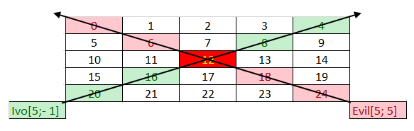

# Exercises: Enumerations

This document defines the exercise assignments for the "Java OOP" course @ Software University.

## Problem 1. Card Suit

Create an enumeration type that has as its constants the four suits of a deck of playing cards (CLUBS, DIAMONDS, HEARTS, SPADES). Iterate over the values of the enumeration type and print all ordinal values and names. 

### Examples

<table>
<thead>
<tr>
<th>Input</th>
<th>Output</th>
</tr>
</thead>
<tbody>
<tr>
<td>Card Suits</td>
<td>Card Suits: Ordinal value: 0; Name value: CLUBS Ordinal value: 1; Name value: DIAMONDS Ordinal value: 2; Name value: HEARTS Ordinal value: 3; Name value: SPADES</td>
</tr>
</tbody>
</table>

## Problem 2. Card Rank

Create an enumeration type that has as its constants the fourteen ranks of a deck of playing cards (ACE, TWO, THREE, FOUR, FIVE, SIX, SEVEN, EIGHT, NINE, TEN, JACK, QUEEN, KING). Iterate over the values of the enumeration type and print all ordinal values and names. 

### Examples

<table>
<thead>
<tr>
<th>Input</th>
<th>Output</th>
</tr>
</thead>
<tbody>
<tr>
<td>Card Ranks</td>
<td>Card Ranks: Ordinal value: 0; Name value: ACE Ordinal value: 1; Name value: TWO Ordinal value: 2; Name value: THREE Ordinal value: 3; Name value: FOUR Ordinal value: 4; Name value: FIVE Ordinal value: 5; Name value: SIX Ordinal value: 6; Name value: SEVEN Ordinal value: 7; Name value: EIGHT Ordinal value: 8; Name value: NINE Ordinal value: 9; Name value: TEN Ordinal value: 10; Name value: JACK Ordinal value: 11; Name value: QUEEN Ordinal value: 12; Name value: KING</td>
</tr>
</tbody>
</table>

## Problem 3. Cards with Power

Create a program that generates a deck of cards (class Card) which have a power. The power of a card is calculated by adding the power of its rank plus the power of its suit. 

Rank powers are as follows: (ACE - 14, TWO - 2, THREE - 3, FOUR - 4, FIVE - 5, SIX - 6, SEVEN - 7, EIGHT - 8, NINE - 9, TEN - 10, JACK - 11, QUEEN - 12, KING - 13).

Suit powers are as follows: (CLUBS - 0, DIAMONDS - 13, HEARTS - 26, SPADES - 39).

You will get a command consisting of two lines. On the first line you will receive the Rank of the card and on the second line you will get the suit of the card. 

Print the output in the format "Card name: ACE of SPADES; Card power: 53".

Note
Try using the enumeration types you have created in the previous problems but extending them with constructors and methods. Try using the Enum.valueOf().

### Examples

<table>
<thead>
<tr>
<th>Input</th>
<th>Output</th>
</tr>
</thead>
<tbody>
<tr>
<td>TWO CLUBS</td>
<td>Card name: TWO of CLUBS; Card power: 2</td>
</tr>
<tr>
<td>ACE SPADES</td>
<td>Card name: ACE of SPADES; Card power: 53</td>
</tr>
</tbody>
</table>

<b>Solution of Problems 1-3: <a href="./cards/src">Cards</a></b>

## Problem 4. Traffic Lights

Implement a simple state machine in the form of a traffic light. Every traffic light has three possible signals - red, green and yellow. Each traffic light can be updated, which changes the color of its signal (e.g. if it is currently red, it changes to green, if it is green it changes to yellow). The order of signals is red -> green -> yellow -> red and so on.

On the first line you will be given multiple traffic light signals in the format "RED GREEN YELLOW". They may be 3, more or less than 3. You need to make as many traffic lights as there are signals in the input.

On the second line, you will receive the n number of times you need to change each traffic light's signal.

Your output should consist of n number of lines, including each updated traffic light's signal. To better understand the problem, see the example below.

### Examples

<table>
<thead>
<tr>
<th>Input</th>
<th>Output</th>
</tr>
</thead>
<tbody>
<tr>
<td>GREEN RED YELLOW 4</td>
<td>YELLOW GREEN RED RED YELLOW GREEN GREEN RED YELLOW YELLOW GREEN RED</td>
</tr>
</tbody>
</table>

<b>Solution: <a href="./trafficlights">Traffic Lights</a></b>

# Exercises: Working with Abstraction
 
In this section your job is to download source code for every problem and refactor it.

## Problem 5. Jedi Galaxy

The next four problems are from Pesho’s preparations for the exam. The code is working, but it doesn’t look good. Rework his solutions in order to avoid repeating code, increase readability and improve performance (perhaps).

Ivo is the illegal son of Darth Vader. But he doesn’t know much about being a powerful Jedi warrior. Meanwhile, Princess Lea just broke up with Han Solo, because he cheated on her. Ivo decided to grab her heart, but he needs your help. He must be powerful enough to impress her and so he starts gathering stars to grow stronger.

His galaxy is represented as a two-dimensional array. Every cell in the matrix is a star that has a value. Ivo starts at the given col and row. He can move only on the diagonal from the lowest left to the upper right, and adds to his score all the stars (values) from the cells he passes through. Unfortunately, there is always an Evil power that tries to prevent his success. 

Evil power starts at the given row and col and instantly destroys all stars on the opposite diagonal – From lowest right to the upper left. 

Ivo adds the values only of the stars that are not destroyed by the evil power.   

You will receive two integers, separated by space, which represent the two dimensional array - the first being the rows and the second being the columns. Then, you must fill the two dimensional array with increasing integers starting from 0, and continuing on every row, like this: 

first row: 0, 1, 2… m

second row: n+1, n+2, n+3… n + n.

### Example

Ivo starts with coordinates row = 5, col = -1. He must collect all stars with value [20, 16, 12, 8, 4]. Evil starts with coordinates row = 5, col = 5. The Evil destroys all stars in range [24, 18, 12, 6, 0]. The star with value 12 is the cross point for Ivo and The Evil, so Ivo skips the stars and collects only these who are not in the evil range. 

  You will also receive multiple pairs of commands in the form of 2 integers separated by a single space. The first two integers will represent Ivo’s start coordinates. The second one will represent the Evil Power’s start coordinates.
The input ends when you receive the command “Let the Force be with you”. When that happens, you must print the value of all stars that Ivo has collected successfully.
Input
•	On the first line, you will receive the number N, M -> the dimensions of the matrix. You must then fill the matrix according to these dimensions.
•	On the next several lines you will begin receiving 2 integers separated by a single space, which represent Ivo’s row and col. On the next line you will receive the Evil Power’s coordinates.
•	There will always be at least 2 lines of input to represent at least 1 path of Ivo and the Evil force.
•	When you receive the command, “Let the Force be with you” the input ends.
Output
•	The output is simple. Print the sum of the values from all stars that Ivo has collected.
Constraints
•	The dimensions of the matrix will be integers in the range [5, 2000].
•	The given rows will be valid integers in the range [0, 2000].
•	The given columns will be valid integers in the range [-231 + 1, 231 - 1]. 
Input	Output
5 5
5 -1
5 5
Let the Force be with you	48
5 5
4 -1
4 5
Let the Force be with you	29
Problem 6. Greedy Times
Finally, you have unlocked the safe and reached the treasure! Inside there are all kinds of gems, cash in different currencies and gold bullions. Next to you there is a bag which unfortunately has a limited space. You don’t have much time so you need to take as much wealth as possible! But in order to get a bigger amount of the most valuable items, you need to keep the following rules:
•	The gold amount in your bag should always be more than or equal to the gem amount at any time
•	The gem amount should always be more than or equal to the cash amount at any time
If you read an item which breaks one of these rules you should not put it in the bag. You should always be careful not to exceed the overall bag’s capacity, because it will tear down and you will lose everything! You will receive the content of the safe on a single line in the format of item - quantity pairs, separated by whitespace. You need to gather only three types of items:
•	Cash - All three letter items 
•	Gem - All items which end on “Gem” (at least 4 symbols)
•	Gold - this type has only one item with the name - “Gold”
Each item which does not fall in one of the above categories is useless and you should skip it. Reading item’s names should be CASE-INSENSITIVE. You should aggregate item’s quantities which have the same name.
If you’ve kept the rules you should escape successfully with a bag full of wealth. Now it’s time to review what you have managed to get out of the safe. Print all the types ordered by total amount in descending order. Inside a type, order the items first alphabetically in descending order and then by their amount in ascending order. Use the following format for each type:
“<{type}> ${total amount}”
“##{item} - {amount}” - each item from this type on new line
Input
•	On the first line, you will receive a number which represents the capacity of the bag
•	On the second line, you will receive a sequence of item - quantity pairs
Output
Print only the types from which you have items in the bag ordered by Total Amount descending. Inside a type order the items first alphabetically in descending order and then by amount in ascending order. Use the following format for each type:
“<{type}> ${total amount}”
“##{item} - {amount}” - each item on new line
Constraints
•	Bag’s max capacity will always be a positive number
•	All quantities will be positive integer in the range [0 … 2100000000]
•	Each item of type gem will have a name - at least 4 symbols
•	Time limit: 0.1 sec. Memory limit: 16 MB
Examples
Input	Output
150
Gold 28 Rubygem 16 USD 9 GBP 8	<Gold> $28
##Gold - 28
<Gem> $16
##Rubygem - 16
<Cash> $9
##USD - 9
24000010
USD 1030 Gold 300000 EmeraldGem 900000 Topazgem 290000 CHF 280000 Gold 10000000 JPN 10000 Rubygem 10000000 KLM 3120010	<Gold> $10300000
##Gold - 10300000
<Gem> $10290000
##Topazgem - 290000
##Rubygem - 10000000
<Cash> $3410010
##KLM - 3120010
##JPN - 10000
##CHF - 280000
80345
RubyGem 70000 JAV 10960 Bau 60000 Gold 80000	<Gold> $80000
##Gold - 80000

