# Lab: Encapsulation

### 1. Sort by Name and Age

Create a class Person, which should have private fields for:

- firstName: String
- lastName: String
- age: Integer
- toString() - override

You should be able to use the class like this:

### Main.java

```java
public static void main(String[] args) throws IOException {
    BufferedReader reader = new BufferedReader(new InputStreamReader(System.in));
    int n = Integer.parseInt(reader.readLine());
    List<Person> people = new ArrayList<>();
    for (int i = 0; i < n; i++) {
        String[] input = reader.readLine().split(" ");
        people.add(new Person(input[0], input[1], Integer.parseInt(input[2])));
    }
    Collections.sort(people, (firstPerson, secondPerson) -> {
        int sComp = firstPerson.getFirstName().compareTo(secondPerson.getFirstName());
        if (sComp != 0) {
            return sComp;
        } else {
            return Integer.compare(firstPerson.getAge(), secondPerson.getAge()); 
        }
    });
    for (Person person : people) {
        System.out.println(person.toString());
    }
}
```

<table>
<thead>
<tr>
<th>Input</th>
<th>Output</th>
</tr>
</thead>
<tbody>
<tr>
<td>5<br>Asen Ivanov 65<br>Boiko Borisov 57<br>Ventsislav Ivanov 27<br>Asen Harizanoov 44<br>Boiko </td>
<td>Angelov 35<br>Asen Harizanoov is 44 years old.<br>Asen Ivanov is 65 years old.<br>Boiko Angelov is 35 years old.<br>Boiko Borisov is 57 years old.<br>Ventsislav Ivanov is 27 years old.</td>
</tr>
</tbody>
</table>

### Solution

Create a new class and ensure proper naming. Define the private fields

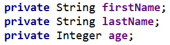

Create getters and apply them access modifiers, which are as strictly as possible

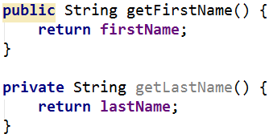

Override toString() method:

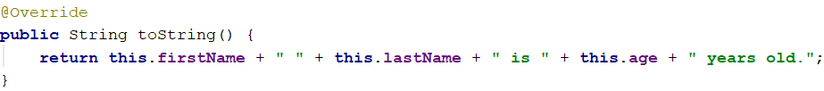

### 2. Salary Increase

Read person with their names, age and salary. Read percent bonus to every person salary. Persons younger than 30 get half bonus. Expand Person from previous task. Add salary field and property with proper access.

New fields and methods

- Salary: Double
- IncreaseSalary(Double bonus)

You should be able to use the class like this:

### Main.java

```java
public static void main(String[] args) throws IOException {
    //TODO: Add reading logic
    doube bonus = Double.parseDouble(reader.readLine());
    for (Person person : people) {
        person.increaseSalary(bonus);
        System.out.println(person.toString());
    }
}
```

### Examples

<table>
<thead>
<tr>
<th>Input</th>
<th>Output</th>
</tr>
</thead>
<tbody>
<tr>
<td>5<br>Asen Ivanov 65 2200<br>Boiko Borisov 57 3333<br>Ventsislav Ivanov 27 600<br>Asen Harizanoov 44 666.66<br>Boiko Angelov 35 559.4<br>20</td>
<td>Asen Ivanov gets 2640.0 leva<br>Boiko Borisov gets 3999.6 leva<br>Ventsislav Ivanov gets 660.0 leva<br>Asen Harizanoov gets 799.992 leva<br>Boiko Angelov gets 671.28 leva</td>
</tr>
</tbody>
</table>

### Solution

Add new private field for salary and proper setters and getters for it

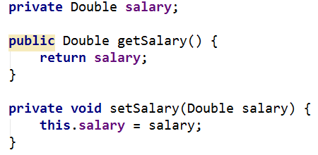

Add new method, which will increase salary with bonus

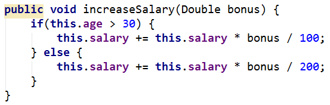

Refactor toString() method for this task.

Note: do not use String.format() in toString() method.

### 3. Validation Data

Expand Person with proper validation for every field:

- Names must be at least 3 symbols
- Age must not be zero or negative
- Salary can't be less than 460.0 

Print proper message to end user (look at example for messages).

Don't use System.out.println() in Person class.

### Examples

<table>
<thead>
<tr>
<th>Input</th>
<th>Output</th>
</tr>
</thead>
<tbody>
<tr>
<td>5<br>Asen Ivanov -6 2200<br>B Borisov 57 3333<br>Ventsislav Ivanov 27 600<br>Asen H 44 666.66<br>Boiko Angelov 35 300<br>20</td>
<td>Age cannot be zero or negative integer<br>First name cannot be less than 3 symbols<br>Last name cannot be less than 3 symbols<br>Salary cannot be less than 460 leva<br>Ventsislav Ivanov gets 660.0 leva</td>
</tr>
</tbody>
</table>

### Solution

Add validation to all setters in Person. Validation may look like this or something similar:

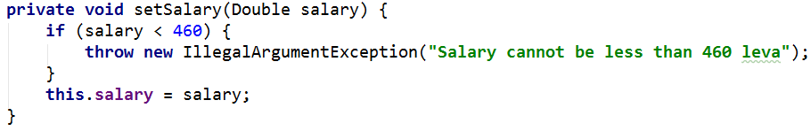

### 4. First and Reserve Team

Create a Team class. Add to this team all person you read. All person younger than 40 go in first team, others go in reverse team. At the end print first and reserve team sizes.

The class should have private fields for:

- Name: String
- First Team Players: List<Person>
- Reserve Team Players: List<Person>

The class should have constructors:

- Team(String name)

The class should also have public methods for:

- addPlayer(Person person): void
- getFirstTeam():  Collections.unmodifiableList
- getReserveTeam():  Collections.unmodifiableList

You should be able to use the class like this:

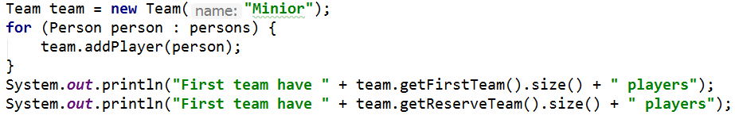

You should NOT be able to use the class like this:

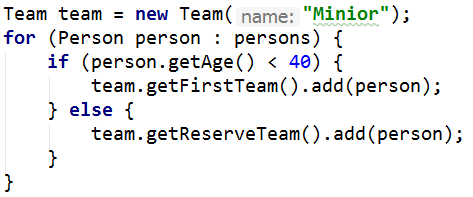

### Examples

<table>
<thead>
<tr>
<th>Input</th>
<th>Output</th>
</tr>
</thead>
<tbody>
<tr>
<td>5<br>Asen Ivanov 20 2200<br>Boiko Borisov 57 3333<br>Ventsislav Ivanov 27 600<br>Grigor Dimitrov 25 666.66<br>Boiko Angelov 35 555</td>
<td>First team have 4 players<br>Reserve team have 1 players</td>
</tr>
</tbody>
</table>

### Solution

Add new class Team. Its fields and constructor look like:

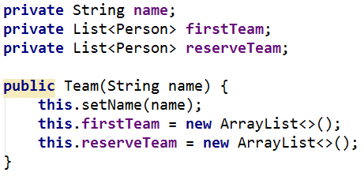

Properties for firstTeam and reserveTeam have only getters:

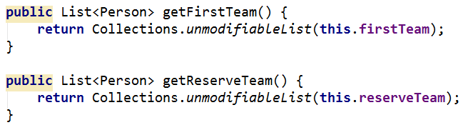

There will be only one method, which add players to teams:

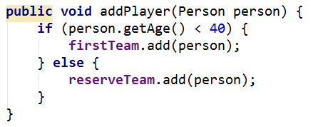

<p><b>Solution to all problems with unit tests: <a href="./encapsulationlab">Encapsulation Lab</a></b></p>

<p><b>Document with tasks description: <a href="resources/02. Java-OOP-Basics-Encapsulation-Lab.docx">02. Java-OOP-Basics-Encapsulation-Lab.docx</a></b></p>