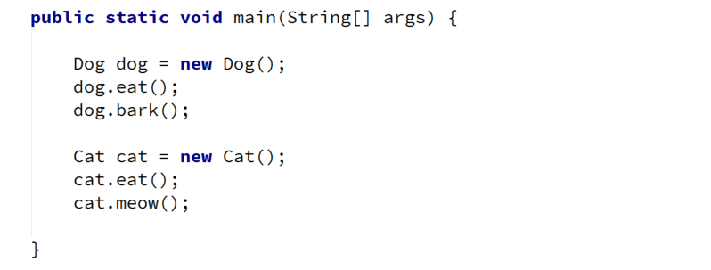

# Lab: Inheritance

Problems for exercises and homework for the "Java OOP" course @ SoftUni.

## Part I: Inheritance

### 1. Single Inheritance

Create two classes named Animal and Dog.

Animal with a single public method eat() that prints: "eating…"

Dog with a single public method bark() that prints: "barking…"

Dog should inherit from Animal.

### Hints

Use the extends keyword to build a hierarchy

<b>Solution: <a href="./singleinheritance/src">Single Inheritance</a></b>

### 2. Multiple Inheritance

Create three classes named Animal, Dog and Puppy.

Animal with a single public method eat() that prints: "eating…"

Dog with a single public method bark() that prints: "barking…"

Puppy with a single public method weep() that prints: "weeping…"

Dog should inherit from Animal. Puppy should inherit from Dog. 

<b>Solution: <a href="./multipleinheritance/src">Multiple Inheritance</a></b>

### 3. Hierarchical Inheritance

Create three classes named Animal, Dog and Cat.

Animal with a single public method eat() that prints: "eating…"

Dog with a single public method bark() that prints: "barking…"

Cat with a single public method meow() that prints: "meowing…"

Dog and Cat should inherit from Animal.

<b>Solution: <a href="./hierarchicalinheritance/src">Hierarchical Inheritance</a></b>

## Part II: Reusing Classes

### 4. Random Array List

Create a RandomArrayList class that has all the functionality of an ArrayList.

Add additional function that returns and removes a random element from the list.

- Public method: getRandomElement(): Object

<b>Solution: <a href="./randomarraylist/src">Random Array List</a></b>

  
### 5. Stack of Strings

Create a class Stack which can store only strings and has the following functionality:

- Private field: data: ArrayList\<String>
- Public method: push(String item): void
- Public method: pop(): String
- Public method: peek(): String
- Public method: isEmpty(): boolean

### Hints

Use composition/delegation in order to have a field in which to store the stack's data

<b>Solution: <a href="./stackofstrings/src">Stack of Strings</a></b>

<b>Document with tasks description: <a href="./resources/03. Java-OOP-Inheritance-Lab.docx">03. Java-OOP-Inheritance-Lab.docx</a></b>
