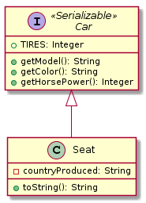
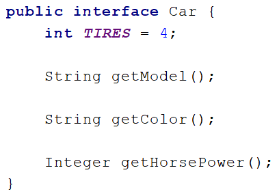
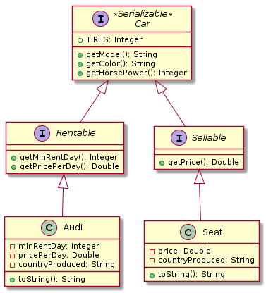
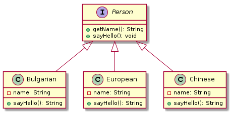
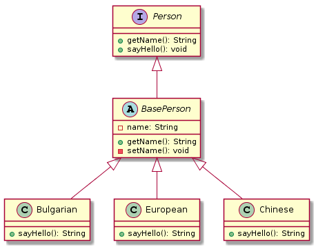
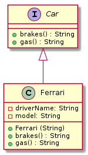
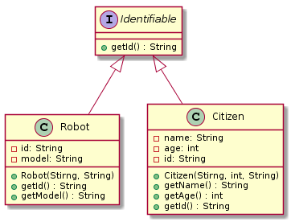

# Lab: Interfaces and Abstraction

Problems for exercises and homework for the "Java OOP" course @ SoftUni.

## Car Shop

Build hierarchy from classes and interfaces for this UML diagram



Your hierarchy have to be used with this code

### Main.java

```java
public static void main(String[] args) {
    Car seat = new Seat("Leon", "gray", 110, "Spain");

    System.out.println(String.format(
            "%s is %s color and have %s horse power",
            seat.getModel(),
            seat.getColor(),
            seat.getHorsePower()));
    System.out.println(seat.toString());
}
```

### Examples

<table>
<thead>
<tr>
<th>Input</th>
<th>Output</th>
</tr>
</thead>
<tbody>
<tr>
<td></td>
<td>Leon is gray and have 110 horrse powers<br>This is Leon produced in Spain and have 4 tires</td>
</tr>
</tbody>
</table>

### Solution



Note: consider using the wrapper classes in the Seat constructor.

<p><b>Solution: <a href="./carshop/src">Car Shop</a></b></p>

## Car Shop Extend

Extend previous problem:



Your hierarchy have to be used with this code

### Main.java

```java
public static void main(String[] args) {
    Sellable seat = new Seat("Leon", "Gray", 110, "Spain", 11111.1);
    Rentable audi = new Audi("A4", "Gray", 110, "Germany", 3, 99.9);

    printCarInfo(seat);
    printCarInfo(audi);
}

private static void printCarInfo(Car car) {
    System.out.println(String.format(
            "%s is %s color and have %s horse power",
            car.getModel(),
            car.getColor(),
            car.getHorsePower()));
    System.out.println(car.toString());
}
```

### Examples

<table>
<thead>
<tr>
<th>Input</th>
<th>Output</th>
</tr>
</thead>
<tbody>
<tr>
<td></td>
<td>Leon is Gray color and have 110 horse power<br>This is Leon produced in Spain and have 4 tires<br>Leon sells for 11111,100000<br>A4 is Gray color and have 110 horse power<br>This is A4 produced in Germany and have 4 tires<br>Minimum rental period of 3 days. Price per day 99,900000</td>
</tr>
</tbody>
</table>

<p><b>Solution: <a href="./carshop/src">Car Shop Extended</a></b></p>

## Say Hello

Build hierarchy from classes and interfaces for this UML diagram



Your hierarchy have to be used with this code

### Main.java

```java
public static void main(String[] args) {
    List<Person> persons = new ArrayList<>();

    
    persons.add(new Bulgarian("Pesho"));
    persons.add(new European("Pesho"));
    persons.add(new Chinese("Pesho"));

    for (Person person : persons) {
        print(person);
    }
}

private static void print(Person person) {
    System.out.println(person.sayHello());
}
```

### Examples

<table>
<thead>
<tr>
<th>Input</th>
<th>Output</th>
</tr>
</thead>
<tbody>
<tr>
<td></td>
<td>Здравей<br>Hello<br>Djydjybydjy</td>
</tr>
</tbody>
</table>

<p><b>Solution: <a href="./sayhello/src">Say Hello</a></b></p>

## Say Hello Extend

Build hierarchy from classes and interfaces for this UML diagram



Your hierarchy have to be used with this code

### Main.java

```java
public static void main(String[] args) {
    List<Person> persons = new ArrayList<>();

    
    persons.add(new Bulgarian("Pesho"));
    persons.add(new European("Pesho"));
    persons.add(new Chinese("Pesho"));

    for (Person person : persons) {
        print(person);
    }
}

private static void print(Person person) {
    System.out.println(person.sayHello());
}
```

### Examples

<table>
<thead>
<tr>
<th>Input</th>
<th>Output</th>
</tr>
</thead>
<tbody>
<tr>
<td></td>
<td>Здравей<br>Hello<br>Djydjybydjy</td>
</tr>
</tbody>
</table>

<p><b>Solution: <a href="./sayhelloextendet/src">Say Hello Extended</a></b></p>

## Ferrari

Model an application which contains a class Ferrari and an interface. Your task is simple, you have a car - Ferrari, its model is "488-Spider" and it has a driver. Your Ferrari should have functionality to use brakes and push the gas pedal. When the brakes are pushed down print "Brakes!", and when the gas pedal is pushed down - "Zadu6avam sA!". As you may have guessed this functionality is typical for all cars, so you should implement an interface to describe it. 



### Input

On the single input line, you will be given the driver's name.

### Output

On the single output line, print the model, the messages from the brakes and gas pedal methods and the driver's name. In the following format:

    <model>/<brakes>/<gas pedal>/<driver's name>

### Constraints

The input will always be valid, no need to check it explicitly! The Driver's name may contain any ASCII characters.

### Example

Input | Output |
---------|----------|
Bat Giorgi | 488-Spider/Brakes!/Zadu6avam sA!/Bat Giorgi
Dinko | 488-Spider/Brakes!/Zadu6avam sA!/Dinko

Note

To check your solution, copy the code below and paste it to the bottom of the code in your main method.

### Reflection

```java
String ferrariName = Ferrari.class.getSimpleName();
String carInterface = Car.class.getSimpleName();
boolean isCreated = Car.class.isInterface();
if (!isCreated) {
    throw new IllegalClassFormatException("No interface created!");
}
```

<p><b>Solution: <a href="./ferrari/src">Ferrari</a></b></p>

## Border Control

It’s the future, you’re the ruler of a totalitarian dystopian society inhabited by citizens and robots, since you’re afraid of rebellions you decide to implement strict control of who enters your city. Your soldiers check the Ids of everyone who enters and leaves.

You will receive from the console an unknown amount of lines until the command “End” is received, on each line there will be the information for either a citizen or a robot who tries to enter your city in the format “\<name> \<age> \<id>” for citizens and “\<model> \<id>” for robots. After the end command on the next line you will receive a single 

The output of your program should consist of all detained Ids each on a separate line (the order of printing doesn’t matter).
number representing the last digits of fake ids, all citizens or robots whose Id ends with the specified digits must be detained.



<table>
<thead>
<tr>
<th>Input</th>
<th>Output</th>
</tr>
</thead>
<tbody>
<tr>
<td>Pesho 22 9010101122<br>MK-13 558833251<br>MK-12 33283122<br>End<br>122</td>
<td>9010101122<br>33283122</td>
</tr>
<tr>
<td>Toncho 31 7801211340<br>Penka 29 8007181534<br>IV-228 999999<br>Stamat 54 3401018380<br>KKK-666 80808080<br>End<br>340</td>
<td>7801211340</td>
</tr>
</tbody>
</table>

## \*MooD 3

You are an owner of the most epic video game of the world - 3 MooD. Your employees have gone on summer vacation. But there is a problem in the application and you are on your own. So the problem is how to store the information for the players. The best approach to you, seems to be, storing them in GameObjects.

In your game, there are two types of characters - Demon and Archangel. All characters in the game have:

- username
- hashedPassword
- level
- special points.

The main difference between the Demon and the Archangel is that the Demon has an energy (as special points) and the Archangel has a mana (as special points). Your task is to model the application.

When you receive the username and the character type, you should generate the hashed password by the formulas below:

- For a Demon: username length * 217
- For an Archangel: (username’s characters in reversed order) + (username’s characters' length * 21)

Your task is to print the info as it is written in the Output.


### Input

The input consists of single line. First, you will get the username of a player. The second parameter is its character type. The next two parameters are his mana / energy points and his level. Format:

    <username> | <character type> | <special points> | <level>

### Output

Print the info on two lines, for a single entry in the database (player) in the format:

    <”username”> | <”hashed password”> -> <character type>
    <special points * level>

### Constraints

- Username – alphabetical letters (Latin), no more than 10 characters and you do not need to check it explicitly. 
- Character type – String, Demon or Archangel, no need to check it explicitly.
- Special points (Mana) – a valid Integer, no need to check it explicitly.
- Special points (Energy) – a valid Double, no need to check it explicitly.
- Level – a valid Integer, no need to check it explicitly.

### Example

<table>
<thead>
<tr>
<th>Input</th>
<th>Output</th>
</tr>
</thead>
<tbody>
<tr>
<td>KoHaH | Demon | 100.0 | 100</td>
<td>""KoHaH"" | "1519" -> Demon<br>10000.0</td>
</tr>
<tr>
<td>Akasha | Archangel | 5 | 100</td>
<td>""Akasha"" | ""ahsakA"168" -> Archangel<br>500</td>
</tr>
</tbody>
</table>

Note

Implement interface, holding the main functionalities of all characters. Create an abstract class to hold all the same characteristics of the characters. If you need to declare a character object, be sure to declare it of type character's interface to the left side and the specific implementation to the right side of the declaration. You should not override the setter for the hashedPassword and instead, use generics to pass them the type for the password and the special points.

<p><b>Solution: <a href="./doom/src">Doom 3</a></b></p>

<p><b>Document with tasks description: <a href="./resources/05. Java-OOP-Interfaces-and-Abstraction-Lab.docx">05. Java-OOP-Interfaces-and-Abstraction-Lab.docx</a></b></p>