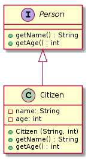
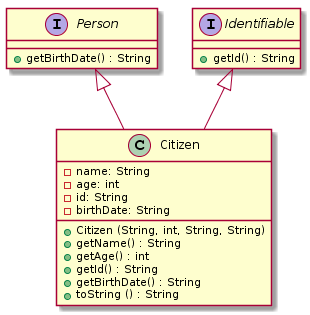
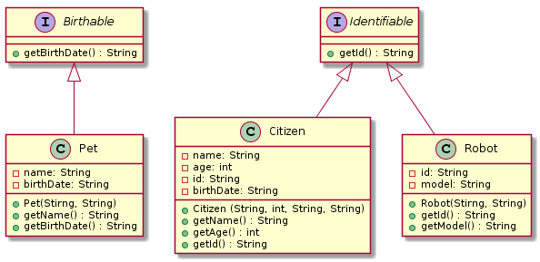
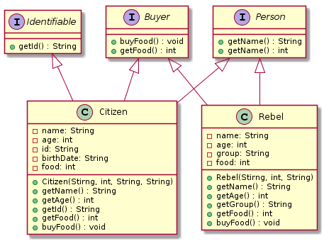
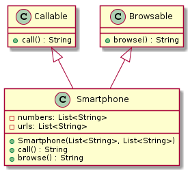

# Exercises: Interfaces

This document defines the exercise assignments for the "Java OOP" course @ Software University.

## Problem 1. Define an Interface Person

Define an interface Person with fields for name and age. Define a class Citizen which implements Person and has a constructor which takes a String name and an int age.
Add the following code to your main method and submit it to Judge.



 ```java
public static void main(String[] args) {
    Class[] citizenInterfaces = Citizen.class.getInterfaces();
    if(Arrays.asList(citizenInterfaces).contains(Person.class)){
        Method[] fields = Person.class.getDeclaredMethods();
        Scanner scanner = new Scanner(System.in);
        String name = scanner.nextLine();
        int age = Integer.parseInt(scanner.nextLine());
        Person person = new Citizen(name,age);
        System.out.println(fields.length);
        System.out.println(person.getName());
        System.out.println(person.getAge());
    }
}
```

If you defined the interface and implemented it correctly, the test should pass.

### Examples

<table>
<thead>
<tr>
<th>Input</th>
<th>Output</th>
</tr>
</thead>
<tbody>
<tr>
<td>Pesho<br>25</td>
<td>2<br>Pesho<br>25</td>
</tr>
</tbody>
</table>

## Problem 2. Multiple Implementation

Using the code from the previous task, define an interface Identifiable with a string property Id and an interface Person with a String field birthDate and implement them in the Citizen class. Rewrite the Citizen constructor to accept the new parameters.

Add the following code to your main method and submit it to Judge.



 ```java
public static void main(String[] args) {
    Class[] citizenInterfaces = Citizen.class.getInterfaces();
    if (Arrays.asList(citizenInterfaces).contains(Birthable.class)
            && Arrays.asList(citizenInterfaces).contains(Identifiable.class)) {
        Method[] methods = Birthable.class.getDeclaredMethods();
        methods = Identifiable.class.getDeclaredMethods();
        Scanner scanner = new Scanner(System.in);
        String name = scanner.nextLine();
        int age = Integer.parseInt(scanner.nextLine());
        String id = scanner.nextLine();
        String birthdate = scanner.nextLine();
        Identifiable identifiable = new Citizen(name,age,id,birthdate);
        Birthable birthable = new Citizen(name,age,id,birthdate);
        System.out.println(methods.length);
        System.out.println(methods[0].getReturnType().getSimpleName());
        System.out.println(methods.length);
        System.out.println(methods[0].getReturnType().getSimpleName());        
    }
}
```

If you defined the interfaces and implemented them, the test should pass.

### Examples

<table>
<thead>
<tr>
<th>Input</th>
<th>Output</th>
</tr>
</thead>
<tbody>
<tr>
<td>Pesho<br>25<br>9105152287<br>15/05/1991</td>
<td>1<br>String<br>1<br>String</td>
</tr>
</tbody>
</table>

## Problem 3. Birthday Celebrations

It is a well known fact that people celebrate birthdays, it is also known that some people also celebrate their pets birthdays. Extend the program from your last task to add birthdates to citizens and include a class Pet, pets have a name and a birthdate. Encompass repeated functionality into interfaces and implement them in your classes. 

You will receive from the console an unknown amount of lines until the command “End” is received,  each line will contain information in one of the following formats “Citizen \<name> \<age> \<id> \<birthdate>” for citizens, “Robot \<model> \<id>” for robots or “Pet \<name> \<birthdate>” for pets. After the end command on the next line you will receive a single number representing a specific year, your task is to print all birthdates (of both citizens and pets) in that year in the format day/month/year (the order of printing doesn’t matter).



### Examples

<table>
<thead>
<tr>
<th>Input</th>
<th>Output</th>
</tr>
</thead>
<tbody>
<tr>
<td>Citizen Pesho 22 9010101122 10/10/1990<br>Pet Sharo 13/11/2005<br>Robot MK-13 558833251<br>End<br>1990</td>
<td>10/10/1990</td>
</tr>
<tr>
<td>Citizen Stamat 16 0041018380 01/01/2000<br>Robot MK-10 12345678<br>Robot PP-09 00000001<br>Pet Topcho 24/12/2000<br>Pet Kosmat 12/06/2002 <br>End<br>2000</td>
<td>01/01/2000<br>24/12/2000</td>
</tr>
<tr>
<td>Robot VV-XYZ 11213141<br>Citizen Penka 35 7903210713 21/03/1979<br>Citizen Kane 40 7409073566 07/09/1974<br>End<br>1975</td>
<td>no output</td>
</tr>
</tbody>
</table>

## Problem 4. Food Shortage

Your totalitarian dystopian society suffers a shortage of food, so many rebels appear. Extend the code from your previous task with new functionality to solve this task.

Define a class Rebel which has a name, age and group (String), names are unique - there will never be 2 Rebels/Citizens or a Rebel and Citizen with the same name. Define an interface Buyer which defines a methods buyFood() and a getFood(). Implement the Buyer interface in the Citizen and Rebel class, both Rebels and Citizens start with 0 food, when a Rebel buys food his Food increases by 5, when a Citizen buys food his Food increases by 10.

On the first line of the input you will receive an integer N - the number of people, on each of the next N lines you will receive information in one of the following formats “\<name> \<age> \<id> \<birthdate>” for a Citizen or “\<name> \<age>\<group>” for a Rebel. After the N lines until the command “End” is received, you will receive names of people who bought food, each on a new line. Note that not all names may be valid, in case of an incorrect name - nothing should happen.  

On the only line of output, you should print the total amount of food purchased.



### Examples

<table>
<thead>
<tr>
<th>Input</th>
<th>Output</th>
</tr>
</thead>
<tbody>
<tr>
<td>2<br>Pesho 25 8904041303 04/04/1989<br>Stancho 27 WildMonkeys<br>Pesho<br>Gosho<br>Pesho<br>End</td>
<td>20</td>
</tr>
<tr>
<td>4<br>Stamat 23 TheSwarm<br>Toncho 44 7308185527 18/08/1973<br>Joro 31 Terrorists<br>Penka 27 881222212 22/12/1988<br>Jiraf<br>Joro<br>Jiraf<br>Joro<br>Stamat<br>Penka<br>End</td>
<td>25</td>
</tr>
</tbody>
</table>

## Problem 5. Telephony

You have a business - manufacturing cell phones. But you have no software developers, so you call your friends and ask them to help you create a cell phone software. They agree and you start working on the project. The project consists of one main model - a Smartphone. Each of your smartphones should have functionalities of calling other phones and browsing in the world wide web.

Your friends are very busy, so you decide to write the code on your own. Here is the mandatory assignment:

You should have a model - Smartphone and two separate functionalities which your smartphone has - to call other phones and to browse in the world wide web. You should end up with one class and two interfaces.



### Input

The input comes from the console. It will hold two lines:

- First line: phone numbers to call (String), separated by spaces.
- Second line: sites to visit (String), separated by spaces.

### Output

- First call all numbers in the order of input then browse all sites in order of input
- The functionality of calling phones is printing on the console the number which are being called in the format:
  
    Calling... \<number>

- The functionality of the browser should print on the console the site in format:

    Browsing: \<site>! (pay attention to the exclamation mark when printing URLs)

- If there is a number in the input of the URLs, print: "Invalid URL!" and continue printing the rest of the URLs.
- If there is a character different from a digit in a number, print: "Invalid number!" and continue to the next number.

### Constraints

- Each site's URL should consist only of letters and symbols (No digits are allowed in the URL address)

### Examples

<table>
<thead>
<tr>
<th>Input</th>
<th>Output</th>
</tr>
</thead>
<tbody>
<tr>
<td>0882134215 0882134333 08992134215 0558123 3333 1<br>http://softuni.bg http://youtube.com http://www.g00gle.com</td>
<td>Calling... 0882134215<br>Calling... 0882134333<br>Calling... 08992134215<br>Calling... 0558123<br>Calling... 3333<br>Calling... 1<br>Browsing: http://softuni.bg!<br>Browsing: http://youtube.com!<br>Invalid URL!</td>
</tr>
</tbody>
</table>

<p><b>Solution of Problems 1 to 5: <a href="./interfacesexercises/src">Exercises: Interfaces</a></b></p>

## Problem 6. Military Elite

Create the following class hierarchy:

- SoldierImpl – general class for soldiers, holding id, first name and last name.
  - PrivateImpl – lowest base soldier type, holding the field salary(double).
    - LeutenantGeneralImpl – holds a set of PrivatesImpl under his command.
    - SpecialisedSoldier – general class for all specialised soldiers – holds the corps of the soldier. The corps can only be one of the following: Airforces or Marines.
      - Engineer – holds a set of repairs. A repair holds a part name and hours worked(int).
      - Commando – holds a set of missions. A mission holds code name and a state (inProgress or Finished). A mission can be finished through the method completeMission().
  - Spy – holds the code number of the spy.

Extract interfaces for each class. (e.g. Soldier, Private, LeutenantGeneral, etc.) The interfaces should hold their public fields and methods (e.g. Isoldier should hold id, first name and last name). Each class should implement its respective interface. Validate the input where necessary (corps, mission state) - input should match exactly one of the required values, otherwise it should be treated as invalid. In case of invalid corps the entire line should be skipped, in case of an invalid mission state only the mission should be skipped. 

You will receive from the console an unknown amount of lines containing information about soldiers until the command “End” is received. The information will be in one of the following formats:

- Private: “Private \<id> \<firstName> \<lastName> \<salary>”
- LeutenantGeneral: “LeutenantGeneral \<id> \<firstName> \<lastName> \<salary> \<private1Id> \<private2Id> … \<privateNId>” where privateXId will always be an Id of a private already received through the input.
- Engineer: “Engineer \<id> \<firstName> \<lastName> \<salary> \<corps> \<repair1Part> \<repair1Hours> … \<repairNPart> \<repairNHours>” where repairXPart is the name of a repaired part and repairXHours the hours it took to repair it (the two parameters will always come paired). 
- Commando: “Commando \<id> \<firstName> \<lastName> \<salary> \<corps> \<mission1CodeName> \<mission1state> … \<missionNCodeName> \<missionNstate>” a missions code name, description and state will always come together.
- Spy: “Spy \<id> \<firstName> \<lastName> \<codeNumber>”

Define proper constructors. Avoid code duplication through abstraction. Override toString() in all classes to print detailed information about the object.

    Privates:
    Name: <firstName> <lastName> Id: <id> Salary: <salary>
    Spy:
    Name: <firstName> <lastName> Id: <id>
    Code Number: <codeNumber>
    LeutenantGeneral:
    Name: <firstName> <lastName> Id: <id> Salary: <salary>
    Privates:
      <private1 ToString()>
      <private2 ToString()>
      …
      <privateN ToString()>
    Note: privates must be sorted by id in descending order.
    Engineer:
    Name: <firstName> <lastName> Id: <id> Salary: <salary>
    Corps: <corps>
    Repairs:
      <repair1 ToString()>
      <repair2 ToString()>
      …
      <repairN ToString()>
    Commando:
    Name: <firstName> <lastName> Id: <id> Salary: <salary>
    Corps: <corps>
    Missions:
      <mission1 ToString()>
      <mission2 ToString()>
      …
      <missionN ToString()>
    Repair:
    Part Name: <partName> Hours Worked: <hoursWorked>
    Mission:
    Code Name: <codeName> State: <state>

NOTE: Salary should be printed rounded to two decimal places after the separator.

### Examples

<table>
<thead>
<tr>
<th>Input</th>
<th>Output</th>
</tr>
</thead>
<tbody>
<tr>
<td>Private 1 Pesho Peshev 22.22<br>Commando 13 Stamat Stamov 13.1 Airforces<br>Private 222 Toncho Tonchev 80.08<br>LeutenantGeneral 3 Joro Jorev 100 222 1<br>End</td>
<td>Name: Pesho Peshev Id: 1 Salary: 22.22<br>Name: Stamat Stamov Id: 13 Salary: 13.10<br>Corps: Airforces<br>Missions:<br>Name: Toncho Tonchev Id: 222 Salary: 80.08<br>Name: Joro Jorev Id: 3 Salary: 100.00<br>Privates:<br>&nbsp;&nbsp;Name: Toncho Tonchev Id: 222 Salary: 80.08<br>&nbsp;&nbsp;Name: Pesho Peshev Id: 1 Salary: 22.22</td>
</tr>
<tr>
<td>Engineer 7 Pencho Penchev 12.23 Marines Boat 2 Crane 17<br>Commando 19 Penka Ivanova 150.15 Airforces HairyFoot finished Freedom inProgress<br>End</td>
<td>Name: Pencho Penchev Id: 7 Salary: 12.23<br>Corps: Marines<br>Repairs:<br>&nbsp;&nbsp;Part Name: Boat Hours Worked: 2<br>&nbsp;&nbsp;Part Name: Crane Hours Worked: 17<br>Name: Penka Ivanova Id: 19 Salary: 150.15<br>Corps: Airforces<br>Missions:<br>&nbsp;Code Name: Freedom State: inProgress</td>
</tr>
<tr>
<td>LeutenantGeneral 17 No Units 500.01<br>Spy 7 James Bond 007<br>Spy 8 James Boned 008<br>End</td>
<td>Name: No Units Id: 17 Salary: 500.01<br>Privates:<br>Name: James Bond Id: 7<br>Code Number: 007<br>Name: James Boned Id: 8<br>Code Number: 008</td>
</tr>
</tbody>
</table>

<p><b>Solution: <a href="./militaryelite/src">Military Elite</a></b></p>

## Problem 7. \*Collection Hierarchy

Create 3 different string collections – AddCollection, AddRemoveCollection and MyListImpl.

The AddCollection should have:

- Only a single method add(String) which adds an item to the end of the collection.

The AddRemoveCollection should have:

- An add(String) method – which adds an item to the start of the collection.
- A remove() method which removes the last item in the collection.

The MyListImpl collection should have:

- An add(String) method which adds an item to the start of the collection.
- A remove() method which removes the first element in the collection.
- A used field which displays the amount of elements currently in the collection.

Create interfaces which define the collections functionality, think how to model the relations between interfaces to reuse code. Add an extra bit of functionality to the methods in the custom collections, add methods should return the index in which the item was added, remove methods should return the item that was removed. 

Your task is to create a single copy of your collections, after which on the first input line you will receive a random amount of strings in a single line separated by spaces - the elements you have to add to each of your collections. For each of your collections write a single line in the output that holds the results of all add operations separated by spaces (check the examples to better understand the format). On the second input line you will receive a single number - the amount of remove operations you have to call on each collection. In the same manner as with the Add operations for each collection (except the AddCollection), print a line with the results of each Remove operation separated by spaces.


### Input

The input comes from the console. It will hold two lines:

- The first line will contain a random amount of strings separated by spaces - the elements you have to add to each of your collections.
- The second line will contain a single number - the amount of remove operations.

### Output

The output will consist of 5 lines:

- The first line contains the results of all add operations on the AddCollection separated by spaces.
- The second line contains the results of all add operations on the AddRemoveCollection separated by spaces.
- The third line contains the result of all add operations on the MyListImpl collection separated by spaces.
- The fourth line contains the result of all remove operations on the AddRemoveCollection separated by spaces.
- The fifth line contains the result of all remove operations on the MyListImpl collection separated by spaces.

Constraints

- All collections should have a length of 100.
- There will never be more than 100 add operations.
- The number of remove operations will never be more than the amount of add operations.

### Examples

<table>
<thead>
<tr>
<th>Input</th>
<th>Output</th>
</tr>
</thead>
<tbody>
<tr>
<td>banichka boza tutmanik<br>3</td>
<td>0 1 2<br>0 0 0<br>0 0 0<br>banichka boza tutmanik<br>tutmanik boza banichka</td>
</tr>
<tr>
<td>one two three four five six seven<br>4</td>
<td>0 1 2 3 4 5 6<br>0 0 0 0 0 0 0<br>0 0 0 0 0 0 0<br>one two three four<br>seven six five four</td>
</tr>
</tbody>
</table>

Hint

Create an interface hierarchy representing the collections. You can use a List as the underlying collection and implement the methods using the List’s Add, Remove and Insert methods.

<p><b>Solution: <a href="./collectionhierarchy/src">Collection Hierarchy</a></b></p>

<p><b>Document with tasks description: <a href="./resources/05. Java-OOP-Interfaces-and-Abstraction-Exercises.docx">05. Java-OOP-Interfaces-and-Abstraction-Exercises.docx</a></b></p>