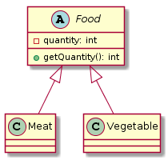
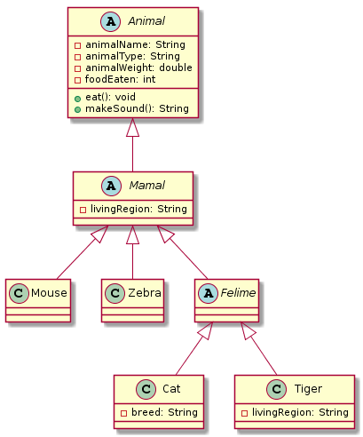

# Exercises: Polymorphism

Problems for exercises and homework for the "Java OOP" course @ SoftUni.

## Problem 1. Vehicles

Write a program that models 2 vehicles (Car and Truck) and will be able to simulate driving and refueling them in the summer. Car and truck both have fuel quantity, fuel consumption in liters per km and can be driven given distance and refueled with given liters. But in the summer both vehicles use air conditioner and their fuel consumption per km is increased by 0.9 liters for the car and with 1.6 liters for the truck. Also the truck has a tiny hole in his tank and when it gets refueled it gets only 95% of given fuel. The car has no problems when refueling and adds all given fuel to its tank. If vehicle cannot travel given distance its fuel does not change.

Input

- On the first line - information about the car in format {Car {fuel quantity} {liters per km}}
- On the second line – info about the truck in format {Truck {fuel quantity} {liters per km}}
- On third line - number of commands N that will be given on the next N lines
- On the next N lines – commands in format
  - Drive Car {distance}
  - Drive Truck {distance}
  - Refuel Car {liters}
  - Refuel Truck {liters}

### Output

After each Drive command print whether the Car/Truck was able to travel given distance in format if it’s successful. Print the distance with two digits after the decimal separator except trailing zeros. Use the DecimalFormat class:

    Car/Truck travelled {distance} km

Or if it is not:

    Car/Truck needs refueling

Finally print the remaining fuel for both car and truck rounded 2 digits after floating point in format:

    Car: {liters}
    Truck: {liters}

### Example

<table>
<thead>
<tr>
<th>Input</th>
<th>Output</th>
</tr>
</thead>
<tbody>
<tr>
<td>Car 15 0.3 Truck 100 0.9 4 Drive Car 9 Drive Car 30 Refuel Car 50 Drive Truck 10</td>
<td>Car travelled 9 km Car needs refueling Truck travelled 10 km Car: 54.20 Truck: 75.00</td>
</tr>
<tr>
<td>Car 30.4 0.4 Truck 99.34 0.9 5 Drive Car 500 Drive Car 13.5 Refuel Truck 10.300 Drive Truck 56.2 Refuel Car 100.2</td>
<td>Car needs refueling Car travelled 13.5 km Truck needs refueling Car: 113.05 Truck: 109.13</td>
</tr>
</tbody>
</table>

## Problem 2. Vehicles Extension

Use your solution of the previous task for starting point and add more functionality. Add new vehicle – Bus. Now every vehicle has tank capacity and fuel quantity cannot fall below 0 (If fuel quantity become less than 0 print on the console “Fuel must be a positive number”). 

The vehicles cannot be filled with fuel more than their tank capacity. If you try to put more fuel in the tank than the available space, print on the console “Cannot fit fuel in tank” and do not add any fuel in vehicles tank. 

Add new command for the bus. The bus can drive with or without people. If the bus is driving with people, the air-conditioner is turned on and its fuel consumption per kilometer is increased with 1.4 liters. If there are no people in the bus when driving the air-conditioner is turned off and does not increase the fuel consumption.

### Input

- On the first three lines you will receive information about the vehicles in format:

Vehicle {initial fuel quantity} {liters per km} {tank capacity}

- On fourth line - number of commands N that will be given on the next N lines
- On the next N lines – commands in format
  - Drive Car {distance}
  - Drive Truck {distance}
  - Drive Bus {distance}
  - DriveEmpty Bus {distance}
  - Refuel Car {liters}
  - Refuel Truck {liters}
  - Refuel Bus {liters}

### Output

- After each Drive command print whether the Car/Truck was able to travel given distance in format if it’s successful:

    Car/Truck/Bus travelled {distance} km

- Or if it is not:

    Car/Truck/Bus needs refueling

- If given fuel is ≤ 0 print “Fuel must be a positive number”.
- If given fuel cannot fit in car or bus tank print “Cannot fit fuel in tank”
- Finally print the remaining fuel for car, truck and bus rounded 2 digits after floating point in format:

    Car: {liters}
    Truck: {liters}
    Bus: {liters}

### Example

<table>
<thead>
<tr>
<th>Input</th>
<th>Output</th>
</tr>
</thead>
<tbody>
<tr>
<td>Car 30 0.04 70 Truck 100 0.5 300 Bus 40 0.3 150 8 Refuel Car -10 Refuel Truck 0 Refuel Car 10 Refuel Car 300 Drive Bus 10 Refuel Bus 1000 DriveEmpty Bus 100 Refuel Truck 1000</td>
<td>Fuel must be a positive number Fuel must be a positive number Cannot fit fuel in tank Bus travelled 10 km Cannot fit fuel in tank Bus needs refueling Cannot fit fuel in tank Car: 40.00 Truck: 100.00 Bus: 23.00</td>
</tr>
</tbody>
</table>

<b>Solution of Problem 1 and 2: <a href="./vehicles/src">Vehicles</a></b>

### Problem 3. Wild farm

Your task is to create a class hierarchy like the picture below. All the classes except Vegetable, Meat, Mouse, Tiger, Cat & Zebra should be abstract. 

Input should be read from the console. Every even line will contain information about the Animal in following format:

    {AnimalType} {AnimalName} {AnimalWeight} {AnimalLivingRegion} [{CatBreed} = Only if its cat]

On the odd lines you will receive information about the food that you should give to the Animal. The line will consist of FoodType and quantity separated by a whitespace.

You should build the logic to determine if the animal is going to eat the provided food. The Mouse and Zebra should check if the food is a Vegetable. If it is they will eat it. Otherwise you should print a message in the format:

    {AnimalType} are not eating that type of food!

Cats eat any kind of food, but Tigers accept only Meat. If Vegetable is provided to a tiger message like the one above should be printed on the console.

After you read information about the Animal and Food then invoke makeSound() method of the current animal and then feed it. At the end print the whole object and proceed reading information about the next animal/food. The input will continue until you receive “End”. After that print the information of all received animals in format:

    {AnimalType} [{AnimalName}, {CatBreed}, {AnimalWeight}, {AnimalLivingRegion}, {FoodEaten}]

Print all AnimalWeight with no trailing zeroes after the decimal separator. Use the DecimalFormat class.

Note: consider overriding toString() method.

### Example

<table>
<thead>
<tr>
<th>Input</th>
<th>Output</th>
</tr>
</thead>
<tbody>
<tr>
<td>Cat Gray 1.1 Home Persian Vegetable 4 End</td>
<td>Meowwww Cat[Gray, Persian, 1.1, Home, 4]</td>
</tr>
<tr>
<td>Tiger Typcho 167.7 Asia Vegetable 1 End</td>
<td>ROAAR!!! Tigers are not eating that type of food! Tiger[Typcho, 167.7, Asia, 0]</td>
</tr>
<tr>
<td>Zebra Doncho 500 Africa Vegetable 150 End</td>
<td>Zs Zebra[Doncho, 500, Africa, 150]</td>
</tr>
<tr>
<td>Mouse Jerry 0.5 Anywhere Vegetable 0 End</td>
<td>SQUEEEAAAK! Mouse[Jerry, 0.5, Anywhere, 0]</td>
</tr>
</tbody>
</table>

<b>Solution: <a href="./wildfarm/src">Wild Farm</a></b>

<b>Document with tasks description: <a href="./resources/05. Java-OOP-Polymorphism-Exercises.docx">05. Java-OOP-Polymorphism-Exercises.docx</a></b>

## Task 4 – Word

You are given the skeleton of a word-processing program (like MS Word, OpenOffice Writer, etc.). The program reads a line of text from the console, then starts reading commands for editing (text-transform) and executing them on the text. Each command changes the text, the following command works on the changed text. When the command exit is entered, the program prints out the modified text and exits. All commands are of the form:

    commandName startIndex endIndex

Where commandName is a string describing which command should be used, startIndex is an integer which describes from which index in the text the command should be applied, endIndex is an integer which describes to which index (exclusive) the command should be applied (i.e.  the command is applied on indices starting from startIndex and ending in endIndex - 1 inclusively)

The skeleton you are provided with contains the following files:

- Main.java – contains the main(String[] args) method, reads input and prints output on the console
- TextTransform.java – contains a base class for any text-transform added to the program
- Command.java – contains class which represents commands
- CommandInterface.java – defines an interface class which handles commands represented as strings (coming from the console, read from main(String[] args)) 
- CommandImpl.java – class which holds the implementation of the CommandInterface

The code uses an Initialization.java file, which is missing, but should define a way to generate a CommandInterface.

The files you are given support all logic necessary to implement the following command:

- uppercase – transforms any alphabetical character in the text in the range [startIndex, endIndex) to its uppercase variant.

    E.g. if the current text is som3. text 
    and we are given the command uppercase 1 7 
    the current text will change to sOM3. Text 
    Note: if startIndex == endIndex, the command has no effect 
    Your task is to add the following commands:

- cut – cuts (removes) characters in the text in the range [startIndex, endIndex), and remembers the last thing that was removed 

    E.g. if the current text is som3. text  
    and we execute the command cut 1 7 
    the current text will change to sext (… I honestly didn’t plan in advance for this to be the result) 
    Note: if startIndex == endIndex, the command has no effect on the text, but “clears” the last remembered cut 

- paste – replaces the characters in the text in the range [startIndex, endIndex) with the characters which were removed by the last cut

    E.g. if we have the text som3. Text and the commands 
    cut 1 7 (text changed to sext) 
    paste 3 4 
    the current text will change to sexom3. t 
    (we paste the last cut – "om3. t" – over the 't' at the end of the text) 
    Note: if startIndex == endIndex, paste will insert the text at position startIndex, meaning that any text at startIndex will be pushed to the right by the inserted text. E.g. if the last command was paste 0 0 (not paste 3 4), the text would be om3. Tsext 

### Input

The program defined in Main.java reads the following input:

A line of text, followed by a sequence of lines containing commands of the format 

    commandName startIndex endIndex,

ending with the command exit.

### Output

The program defined in Main.java writes the following output:

The modified line of text.

### Restrictions

The input text will be no more than 30 characters long and there will be no more than 10 commands in the input (this task is not about algorithm optimization).

For currentTextLength equal to the current number of characters in the text, for any command:

    0 <= startIndex <= endIndex < currentTextLength

(i.e. the input will always be valid)

There will always be at least 1 cut command before any paste command. Consecutive paste commands (without cut between them) will paste the same text (just like in any text editor – you can cut something and paste it several times). 

The total running time of your program should be no more than 0.1s

The total memory allowed for use by your program is 16MB

### Example I/O

<table>
<thead>
<tr>
<th>Input</th>
<th>Output</th>
</tr>
</thead>
<tbody>
<tr>
<td>som3. text cut 1 7 paste 3 4 exit</td>
<td>sexom3. t</td>
</tr>
<tr>
<td>abc d e cut 0 4 uppercase 1 3 paste 1 2 exit</td>
<td>dabc E</td>
</tr>
</tbody>
</table>

<b>Solution: <a href="./word/src">Word</a></b>

<b>Document with tasks description: <a href="./resources/04. Word_04. Word-Description.docx">04. Word_04. Word-Description.docx</a></b>

<b>Skeleton: <a href="./resources/04. Word_04. Word-Skeleton/">04. Word_04. Word-Skeleton</a></b>

## Task 5 – Calculator

You are given the skeleton of a calculator program (like the Calculator app in Windows, or the calculator on your smartphone, etc.). The program reads numbers and operations from the console and executes those operations on the numbers. The numbers are positive integers, while the operations can be single symbols (e.g. the star symbol '*' means multiplication), or strings of characters (e.g. the operation "end" stops the program and prints out the result).

Operations are executed immediately after they receive all their needed operands. For example, the expression 3 * 4 / 2 will first store 3, then see the multiplication and wait for a number to multiply – when it receives 4 it will calculate 3 * 4 = 12, then see the division and wait for a number to divide by – when it receives 2, it will divide 12 by 2.

Any number input overwrites the current result of the calculator, just like in normal calculators. For example, if the expression 3 1 * 4 16 / 2 is input, we’d first have 3, overwrite it with 1, multiply by 4 and get 4, but then we overwrite with 16 and divide that by 2 – the result will be 8.

The skeleton you are provided with contains the following files:

- Main.java– contains the main(String[] args) method, reads input and prints output on the console
- Operation.java – contains a base class for any operation done by the calculator
- MultiplicationOperation.java – defines a class which inherits the base Operation class and implements the multiplication operation (*)
- CalculationEngine.java – defines the calculator’s central logic of handling number and operations input
- InputInterpreter.java – defines a class which can interpret a string into either a number or an operation and invoke the engine accordingly

The files you are given support all logic necessary to implement the multiplication operation, as well as console input and output (note that input items don’t need to be on the same line – you can write 1 operation or number per line and the code will still work) but are missing the logic to instantiate an InputInterpreter, which should be defined in the missing Extensions.java file.

Your task is to study the provided code and add the following operations:

- / – division, divides the current result of the calculator by the next number the calculator receives, and pushes the result to the calculator (i.e. same as multiplication, but divides)
- ms – saves the current result of the calculator to “memory”. The result of this operation is the current result of the calculator. For example, the expression 3 * 4 ms * 5 and the expression 3 * 4 * 5 are equivalent in their result
- mr – memory recall, removes the last item from memory, and sends it to the calculator. Note that this operation can be used in combination with other operations, for example the expression 3 ms * 4 ms * 5 * mr * mr will save 3 to memory, calculate to 12, save to memory, calculate 60, multiply that by 12 from memory, resulting in 720, then multiply that by 3 from memory, resulting in 2160. It can also be used without operations –  3 ms 4 mr is the same as 3 4 3

Input

The program defined in Main.java reads the following input:

Strings, representing numbers or operations, separated by spaces (or new lines, or any “blank” space), ending with the string end.

Output

The program defined in Main.java writes the following output:

The calculated result of all the numbers and operations from the input.

Restrictions

The numbers in the input will always be positive integers and no operation will result in a number larger than 1 billion.

There will always be at least 1 ms operation before any mr operation. There will be no more mr operations than the preceding ms operations. There will be no ms operation following an operation expecting a value (e.g. 3 * ms 4 is not a valid input, but 3 ms * 4 is). There will never be an invalid series of operations (e.g. 3 / / 4, or 3 * * 4, etc.)

The first 40% of the tests will NOT contain ms or mr operations.

The total running time of your program should be no more than 0.1s 

The total memory allowed for use by your program is 16MB

### Example I/O

<table>
<thead>
<tr>
<th>Input</th>
<th>Output</th>
</tr>
</thead>
<tbody>
<tr>
<td>1 * 2 * 3 ms * 4 * mr / 2 end</td>
<td>72</td>
</tr>
<tr>
<td>12 / 3 ms / 2 ms * 5 mr * mr end</td>
<td>8</td>
</tr>
</tbody>
</table>

<b>Solution: <a href="./calculator/src">Calculator</a></b>

<b>Document with tasks description: <a href="./resources/05. Calculator_05. Calculator-Description.docx">05. Calculator_05. Calculator-Description.docx</a></b>

<b>Skeleton: <a href="./resources/05. Calculator_05. Calculator-Skeleton/">05. Calculator_05. Calculator-Skeleton</a></b>
