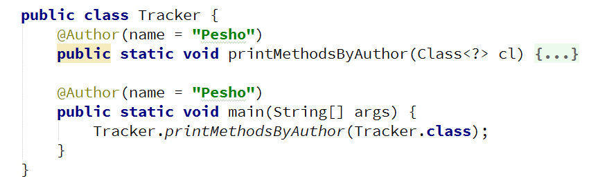

# Lab: Reflection and Annotations

Problems for exercises and homework for the "Java OOP" course @ SoftUni.

## Part I: Reflection

### 1. Reflection

Import "Reflection class" to your "src" folder in your project. Try to use reflection and print some information about this class. Print everything on new line: 

- This class type
- Super class type 
- All interfaces that are implemented by this class
- Instantiate object using reflection and print it too

Don’t change anything in "Reflection class"! 

#### Solution

### 2. Getters and Setters

Using reflection to get all "Reflection class" methods. Then prepare an algorithm that will recognize, which methods are getters and setters. Sort each collection alphabetically by methods names. Print to console each getter on new line in format: 

    {name} will return {Return Type}

Then print all setters in format:

    {name} and will set field of {Parameter Type}

Do this without changing anything in "Reflection class"

### 3. High Quality Mistakes

You are already expert of High Quality Code, so you know what kind of access modifiers must be set to members of class. Time for revenge has come. Now you have to check code produced by your "Beautiful and Smart" trainers in  class Reflection. Check all fields and methods access modifiers. Sort each category of members alphabetically. Print on console all mistakes in format:

- Fields
  - {fieldName} must be private!
- Getters
  - {methodName} have to be public!
- Setters 
  - {methodName} have to be private!

If you find more than 3 errors go to your trainer and tell him "Your code is full of bugs. You don’t understand encapsulation man"

## Part II: Annotations

### 4. Create Annotation

Create annotation Subject with a String[] element called categories, that: 

- Should be available at runtime
- Can be placed only on types

#### Examples

### 5. Coding Tracker

Create annotation Author with a String element called name, that:

- Should be available at runtime
- Can be placed only on methods

Create a class Tracker with a method:

- static void printMethodsByAuthor()

#### Examples

<b>Solution: <a href="./lab/src">Lab</a></b>

<b>Document with tasks description: <a href="./resources/07. Java-OOP-Reflection-and-Annotations.docx">07. Java-OOP-Reflection-and-Annotations.docx</a></a></b>
