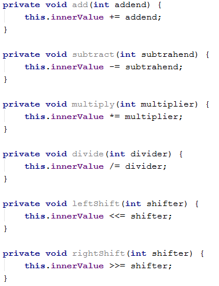
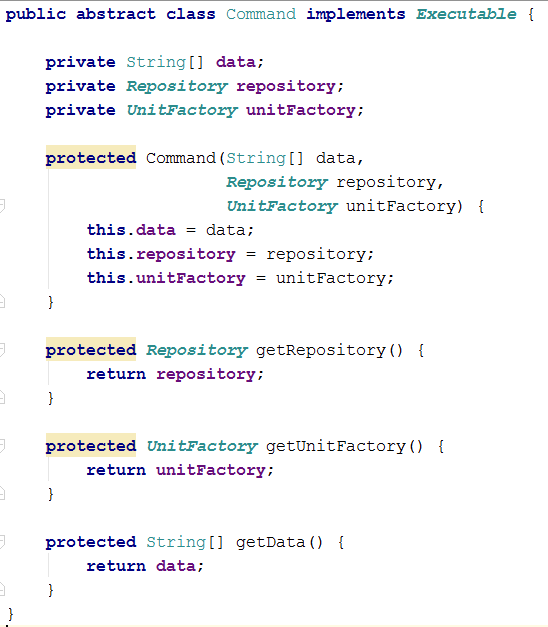

# Exercises: Reflection

This document defines the exercises for "Java OOP Advanced" course @ Software University.

## Problem 1. Harvesting Fields

You are given a RichSoilLand class with lots of fields (look at the provided skeleton). Like the good farmer you are, you must harvest them. Harvesting means that you must print each field in a certain format (see output).

### Input

You will receive a maximum of 100 lines with one of the following commands:

- private - print all private fields
- protected - print all protected fields
- public - print all public fields
- all - print ALL declared fields
- HARVEST - end the input

### Output

For each command you must print the fields that have the given access modifier as described in the input section. The format in which the fields should be printed is:

"\<access modifier> \<field type> \<field name>"

### Examples

<table>
<thead>
<tr>
<th>Input</th>
<th>Output</th>
</tr>
</thead>
<tbody>
<tr>
<td>protected HARVEST</td>
<td>
protected String testString 
protected double aDouble 
protected byte testByte 
protected StringBuilder aBuffer 
protected BigInteger testBigNumber 
protected float testFloat 
protected Object testPredicate 
protected Object fatherMotherObject 
protected String moarString 
protected Exception inheritableException 
protected Stream moarStreamz
</td>
</tr>
<tr>
<td>private public private HARVEST</td>
<td>private int testInt 
private long testLong 
private Calendar aCalendar 
private char testChar 
private BigInteger testBigInt 
private Thread aThread 
private Object aPredicate 
private Object hiddenObject 
private String anotherString 
private Exception internalException 
private Stream secretStream 
public double testDouble 
public String aString 
public StringBuilder aBuilder 
public short testShort 
public byte aByte 
public float aFloat 
public Thread testThread 
public Object anObject 
public int anotherIntBitesTheDust 
public Exception justException 
public Stream aStream 
private int testInt 
private long testLong 
private Calendar aCalendar 
private char testChar 
private BigInteger testBigInt 
private Thread aThread 
private Object aPredicate 
private Object hiddenObject 
private String anotherString 
private Exception internalException 
private Stream secretStream</td>
</tr>
<tr>
<td>all HARVEST</td>
<td>private int testInt 
public double testDouble 
protected String testString 
private long testLong 
protected double aDouble 
public String aString 
private Calendar aCalendar 
public StringBuilder aBuilder 
private char testChar 
public short testShort 
protected byte testByte 
public byte aByte 
protected StringBuilder aBuffer 
private BigInteger testBigInt 
protected BigInteger testBigNumber 
protected float testFloat 
public float aFloat 
private Thread aThread 
public Thread testThread 
private Object aPredicate 
protected Object testPredicate 
public Object anObject 
private Object hiddenObject 
protected Object fatherMotherObject 
private String anotherString 
protected String moarString 
public int anotherIntBitesTheDust 
private Exception internalException 
protected Exception inheritableException 
public Exception justException 
public Stream aStream 
protected Stream moarStreamz 
private Stream secretStream</td>
</tr>
</tbody>
</table>

<b>Solution: <a href="./harvestingfields/src">Harvesting Fields</a></b>

## Problem 2. Black Box Integer

You are helping a buddy of yours who is still in the OOP Basics course - his name is Peshoslav (not to be mistaken with real people or trainers). He is rather slow and made a class with all private members. Your tasks are to instantiate an object from his class (always with start value 0) and then invoke the different methods it has. Your restriction is to not change anything in the class itself (consider it a black box). You can look at his class but don't touch anything! The class itself is called BlackBoxInt. It is a wrapper for the int primitive. The methods it has are:

### Input

The input will consist of lines in the form:

\<command name>_\<value>

For instance: add_115

Input will always be valid and in the format described, so there is no need to check it explicitly. You stop receiving input when you encounter the command "END".

### Output

Each command (except the END one) should print the current value of innerValue of the BlackBoxInt object you instantiated. Don't cheat by overriding toString in the class - you must get the value from the private field.

### Examples

<table>
<thead>
<tr>
<th>Input</th>
<th>Output</th>
</tr>
</thead>
<tbody>
<tr>
<td>add_999999 subtract_19 divide_4 multiply_2 rightShift_1 leftShift_3 END</td>
<td>999999 999980 249995 499990 249995 1999960</td>
</tr>
</tbody>
</table>

<b>Solution: <a href="./privateclassfiddling/src">Black Box Integer</a></b>

## Problem 3. BarracksWars - A New Factory

You are given a small console based project called Barracks (the code for it is included in the provided skeleton).

The general functionality the project has is adding new units to its repository and printing a report with statistics about the units currently in the repository. First let's go over the original task the project was made for:

### Input

The input consists of commands each on a separate line. Commands that execute the functionality are:

- add \<Archer/Swordsman/Pikeman/{…}> - adds a unit to the repository.
- report - prints a lexicological ordered statistic about the units in the repository.
- fight - ends the input.

### Output

Each command except fight should print output on the console.

- add should print: "\<Archer/Swordsman/Pikeman/{…}> added!"
- report should print all the info in the repository in the format: "\<UnitType> -> \<UnitQuantity>", sorted by UnitType

### Constraints

- Input will consist of no more than 1000 lines
- report command will never be given before any valid add command was provided

### Your task

1) You have to study the code of the project and figure out how it works. However, there are parts of it that are not implemented (left with TODOs). You must implement the functionality of the createUnit method in the UnitFactoryImpl class so that it creates a unit based on the unit type received as parameter. Implement it in such a way that whenever you add a new unit it will be creatable without the need to change anything in the UnitFactoryImpl class (psst - use reflection). You can use the approach called Simple Factory.
2) Add two new unit classes (there will be tests that require them) - Horseman with 50 health and 10 attack and Gunner with 20 health and 20 attack.

If you do everything correctly for this problem, you should write code only in the factories and units packages.

### Examples

<table>
<thead>
<tr>
<th>Input</th>
<th>Output</th>
</tr>
</thead>
<tbody>
<tr>
<td>add Swordsman add Archer add Pikeman report add Pikeman add Pikeman report fight</td>
<td>Swordsman added! Archer added! Pikeman added! Archer -> 1 Pikeman -> 1 Swordsman -> 1 Pikeman added! Pikeman added! Archer -> 1 Pikeman -> 3 Swordsman -> 1</td>
</tr>
<tr>
<td>add Pikeman add Pikeman add Gunner add Horseman add Archer add Gunner add Gunner add Horseman report fight</td>
<td>Pikeman added! Pikeman added! Gunner added! Horseman added! Archer added! Gunner added! Gunner added! Horseman added! Archer -> 1 Gunner -> 3 Horseman -> 2 Pikeman -> 2</td>
</tr>
</tbody>
</table>

## Problem 4. \* BarracksWars - The Commands Strike Back

As you might have noticed commands in the project from Problem 3 are implemented via a switch case with method calls in the Engine class. Although this approach works it is flawed when you add a new command because you have to add a new case for it. In some projects you might not have access to the engine and this would not work. Imagine this project will be outsourced and the outsourcing firm will not have access to the engine. Make it so whenever they want to add a new command they won't have to change anything in the Engine.

To do so employ the design pattern called Command Pattern. Here is how the base (abstract) command should look like:

Notice how all commands that extend this one will have both a Repository and a UnitFactory although not all of them need these. Leave it like this for this problem, because for the reflection to work we need all constructors to accept the same parameters. We will see how to go around this issue in problem 5.

Once you've implemented the pattern add a new command. It will have the following syntax:

- retire \<UnitType> - All it has to do is remove a unit of the provided type from the repository.
  - If there are no such units currently in the repository print: "No such units in repository."
  - If there is such a unit currently in the repository, print: "\<UnitType> retired!"

To implement this command, you will also have to implement a corresponding method in the UnitRepository.

If you do everything correctly for this problem, you should write/refactor code only in the core and data packages.

### Examples

<table>
<thead>
<tr>
<th>Input</th>
<th>Output</th>
</tr>
</thead>
<tbody>
<tr>
<td>retire Archer add Pikeman add Pikeman add Gunner add Horseman add Archer add Gunner add Gunner add Horseman report retire Gunner retire Archer report retire Swordsman retire Archer fight</td>
<td>No such units in repository. Pikeman added! Pikeman added! Gunner added! Horseman added! Archer added! Gunner added! Gunner added! Horseman added! Archer -> 1 Gunner -> 3 Horseman -> 2 Pikeman -> 2 Gunner retired! Archer retired! Archer -> 0 Gunner -> 2 Horseman -> 2 Pikeman -> 2 No such units in repository. No such units in repository.</td>
</tr>
</tbody>
</table>

## Problem 5. \* BarracksWars - Return of the Dependencies

In the final part of this epic problem trilogy we will resolve the issue where all Commands received all utility classes as parameters in their constructors. We can accomplish this by using an approach called dependency injection container. This approach is used in many frameworks like Spring for instance.

We will do a little twist on that approach. Remove all fields from the abstract command except the data. Instead put whatever fields each command needs in the concrete class. Create an annotation called Inject and make it so it can be used only on fields. Put the annotation over the fields we need to set trough reflection. Once you've prepared all of this, write the necessary reflection code in the Command Interpreter (which you should have refactored out from the engine in problem 4).

Use the tests from problem 4 to test your solution.

<b>Solution of problems 3 to 5: <a href="./barracks/src">Barracks</a></b>

<b>Document with tasks description: <a href="./resources/07. Java-OOP-Advanced-Reflection-Exercises.docx">07. Java-OOP-Advanced-Reflection-Exercises.docx</a></b>
