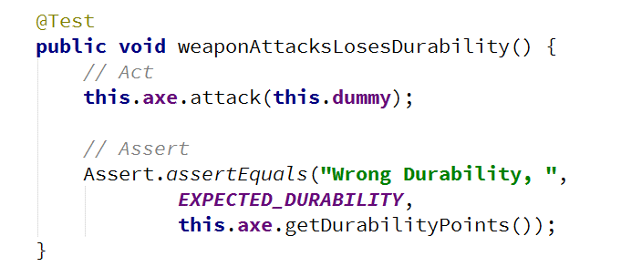
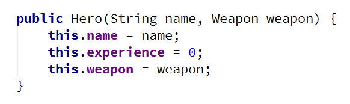

# Lab: Unit Testing

Problems for exercises and homework for the "Java OOP" course @ SoftUni.

## Part I: Unit Testing Basics

### 0. Create Maven Project

Maven is build automation tool that takes care of dependencies for your project. Before you can make one, make sure that you enable the plugin in IntelliJ [File -> Settings -> Plugins -> Maven Integration]

Now, you can create a Maven project

Group Id should be separated by dots, Artifact Id should be separated by hyphens

If everything is ok, you should see the following project structure

Copy the files provided and place them in a package inside src/main/java folder

### 1. Test Axe

In test/java folder, create a package called rpg_tests

Create a class AxeTests

Create the following tests:

- Test if weapon loses durability after each attack
- Test attacking with a broken weapon

#### Solution

Create the new package rpg_tests and inside create the class AxeTests

Inside the class create your first test

Arrange preconditions

Execute tested behaviour

Assert postconditions

Create your second test method

Arrange preconditions and test behaviour

### 2. Test Dummy

Create a class DummyTests

Create the following tests:

- Dummy loses health if attacked
- Dead Dummy throws exception if attacked
- Dead Dummy can give XP
- Alive Dummy can't give XP

#### Hints

Follow the logic of the previous problem

### 3. Refactor Tests

Refactor the tests for Axe and Dummy classes

Make sure that:

- Names of test methods are descriptive
- You use appropriate assertions (assert equals vs assert true)
- You use assertion messages
- There are no magic numbers
- There is no code duplication (Don’t Repeat Yourself)

#### Hints

Extract constants and private fields for Axe class

Create a method that executes before each test

Make use of constants and private fields, as well as add assertion messages

Follow the same logic for other test methods and TestDummy class

## Part II: Dependencies

### 4. Fake Axe and Dummy

Test if hero gains XP when target dies

To do this, you need to: 

- Make Hero class testable (use Dependency Injection)
- Introduce Interfaces for Axe and Dummy
  - Interface Weapon
  - Interface Target

Create fake Weapon and fake Dummy for the test

### Hints

Create Weapon interface

Create Target interface

Implement interfaces

Modify implementation methods to make use of interfaces

Modify both Axe and Dummy classes

Use Dependency Injection for Hero class

Create HeroTests class and test gaining XP functionality by faking Weapon and Target classes

### 5. Mocking

Include Mockito in the project dependencies, then:

1. Mock fakes from previous problem
2. Implement Hero Inventory, holding unequipped weapons
    1. method - Iterable<Weapon> getInventory()
3. Implement Target giving random weapon upon death
   1. field - private List<Weapon> possibleLoot
4. Test Hero killing a target getting loot in his inventory

Hints
Locate pom.xml

Add Mockito dependency

Go to HeroTests and refactor the code, making use of Mockito

*Implement hero inventory and Target dropping loot functionalities
*Test Hero getting loot upon killing a Target

<b>Solution: <a href="./lab">RPG</a></b>

<b>Document with tasks description: <a href="./resources/09. Java-OOP-Unit-Testing-Lab.docx">09. Java-OOP-Unit-Testing-Lab.docx</a></b>

<b>Resources: <a href="./resources/Resources.zip">Resources.zip</a></b>
