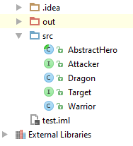

# Lab: Object Communication and Events

Problems for exercises and homework for the "Java OOP" course @ SoftUni.

## Part I: Command Design Pattern

### 0. Resources

You are given a file with some classes. Place them in a new project and get familiar with them. 

### 1. Command

Create a Command Pattern Executor and provide:

- interface Command
  - void execute()
- interface Executor
  - void executeCommand(Command command)
- Concrete Executor named CommandExecutor implements Executor
- Concrete Commands
  - TargetCommand with constructor (Attacker, Target)
  - AttackCommand with constructor (Attacker)

#### Hints

Create the interfaces

Each new command should implement Command, so it can be executed by the Executor

Create as many commands as you like

Test your commands

## Part II: Observer Design Pattern

### 2. Observer

Implement the Observer Design Pattern by providing the following: 

- interface Subject
  - void register(Observer)
  - void unregister(Observer)
  - void notifyObservers()
- interface Observer
  - update(int)

If a Target dies, it should send reward to all of its Observers 

#### Hints

Create the interfaces

Attacker should be the Observer

Dragon should be the Subject - (the easiest way is to make Target extends Subject, but this is violation of the Interface Segregation Principle). The better solution is to create a new interface ObservableTarget and implement both Target and Observer.

<b>Solution: <a href="./lab/src">Lab</a></b>

<b>Document with tasks description: <a href="./resources/11. Java-OOP-Object-Communication-Lab.docx">11. Java-OOP-Object-Communication-Lab.docx</a></b>
