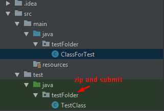

# OOP Advanced Exam – H.E.L.L.

In a galaxy far away, a civilization called – The Lightmen organizes an annual tournament. The participants are striving for power through the use of marvelous magical items, in order to win the unnatural fray – H.E.L.L. 

## Overview

Due to the fact that H.E.L.L. has gotten way out of hand and there have been countless... casualties, the Light Council decided to cancel the tournament. But the light people were not very happy with that decision, so the Council had the idea of a mini-game that simulates the tournament. Guess who they hired to write the code for it. That’s right! You!

## Structure

Here are the entities that should exist as models in your program.

### Heroes

The main participants of the tournament are Heroes. Each hero has several stats:

- `Name` – a string, indicating the name of the hero.
- `Strength` – an integer, indicating the strength of the hero. 
- `Agility` – an integer, indicating the agility of the hero.
- `Intelligence` – an integer, indicating the intelligence of the hero.
- `HitPoints` – an integer, indicating the hit points of the hero.
- `Damage` – an integer, indicating the damage of the hero.

The heroes also have an `Inventory`. The inventory will be given to you in the skeleton. 

You can check more info about it in the Skeleton section.

There are generally 3 types of heroes – `Barbarian`, `Assassin`, and `Wizard`.

### Items

Aside from the heroes there are items.

The items have several properties:

- `Name` – a string, indicating the name of the item.
- `StrengthBonus` – an integer, indicating the strength bonus of the item.
- `AgilityBonus` – an integer, indicating the agility bonus of the item.
- `IntelligenceBonus` – an integer, indicating the intelligence bonus of the item.
- `HitPointsBonus` – an integer, indicating the hit points bonus of the item.
- `DamageBonus` – an integer, indicating the damage bonus of the item. 

There are two types of items – CommonItem and RecipeItem.

- The `CommonItem` is just a normal item.
- The `RecipeItem` has RequiredItems – a collection of CommonItem.

The `RecipeItem` will be initialized with an additional element – the RequiredItems. Check in the Input section for more info.

## Functionality

As you can see the main logic goes around several entities – the heroes and the items. The heroes have items which increase their stats. The heroes also have an inventory, in which their items are being held. There are also recipe items which have a little more interesting logic behind themselves.

### Heroes

The difference between the 3 types of heroes (Strength, Agility, Intelligence) is the base stats, they start with. They are constant values.

| Stats        | Barbarian | Assassin | Wizard |
| ------------ | --------- | -------- | ------ |
| Strength     | 90        | 25       | 25     |
| Agility      | 25        | 100      | 25     |
| Intelligence | 10        | 15       | 100    |
| HitPoints    | 350       | 150      | 100    |
| Damage       | 150       | 300      | 250    |

Upon initialization, each hero should be assigned the values, specified above, depending on his type.

### Items

#### `CommonItem`

If a hero has a certain CommonItem in his inventory, his stats are increased, by the value of the stat bonuses of the item, CORRESPONDINGLY.
In other words: If a hero has an item with 50 strength bonus, in his inventory, the hero’s strength is increased by 50. 

If a CommonItem is removed from the inventory, all bonuses from it, are also removed.

#### `RecipeItem`

When a hero has a RecipeItem in his Inventory, it does NOT give him ANY of its bonuses. The RecipeItem is formed from its RequiredItems. 

When a hero has all of the items that a RecipeItem requires, those items are being removed from his inventory, along with the recipe, and a CommonItem is put on their place, with the stats of the RecipeItem.

As if the items have combined with the recipe in order to create a stronger item.

### Commands

There are several commands which are given from the user input, in order to control the game of H.E.L.L. Here you can see how they are formed. 

The parameters will be given in the EXACT ORDER, as the one specified below. 

You can see the exact input format in the Input section.

Each command will generate an output result, which you must print.

You can see the exact output format in the Output section.

#### Hero Command

Parameters – name (string), type (string).

Creates a Hero of the given type, with the given name. 

The type will either be “Barbarian”, “Assassin” or “Wizard”.

#### Item Command

Parameters – name (string), heroName (string), strengthBonus (int), agilityBonus (int), intelligenceBonus (int), hitpointsBonus (int), damageBonus (int).

Creates a CommonItem with the given parameters, and adds it to the inventory of the hero with the given name.

#### Recipe Command

Parameters – name (string), heroName (string), strengthBonus (int), agilityBonus (int), intelligenceBonus (int), hitpointsBonus (int), damageBonus (int), requiredItem1 (string), requiredItem2 (string). . .
Creates a RecipeItem with the given parameters, and adds it to the inventory of the hero with the given name.

The required items are given last, and their COUNT is VARIABLE. The required items are given as names of items. 

Inspect Command

Parameters – name (string)

Inspects the hero with the given name, providing information about his stats and items.

The command should present information ONLY about the CommonItems from the hero.

#### Quit

Quits the game. . . When that happens, ALL HEROES must be printed in a specific format.

## Skeleton
In this section you will be given information about the Skeleton, or the code that has been given to you. 

You are allowed to change the internal and private logic of the classes that have been given to you. 

In other words, you can change the body code and the definitions of the private members in whatever 

way you like. 

However. . .

You are NOT ALLOWED to CHANGE the Interfaces that have been provided by the skeleton in ANY way. 

You are NOT ALLOWED to ADD more PUBLIC LOGIC, than the one, provided by the Interfaces.

### Interfaces

You will be given the DOCUMENTED interfaces for the Hero and Item entities. You should use them when you are implementing your entities. 

You will also be given an interface for the Inventory class, but you will be given the class itself too.

You will also be given an annotation, connected to the Inventory class, which will ease your work, in some way.

Read the documentation of the interfaces to gain basic knowledge of the behavior they define.

### Inventory

You will be given the Inventory class, along with an Interface for it.

The Inventory’s main purpose is to store the items of a particular hero.

The Inventory class holds 2 collections – for the CommonItems and for the RecipeItems. They are being stored in different collections for obvious reasons...

The collections are private, so in order to add items to them, the class exposes 2 methods for adding elements. 

Upon adding a RecipeItem or a CommonItem, the Inventory checks all recipes, and if all required items, to a certain recipe, have been gathered, it combines them with the recipe and creates a CommonItem with the stats of the corresponding RecipeItem.

The Inventory also holds several methods, for extracting the bonuses from all CommonItems, because only they give bonuses to the hero.

Your task is to study the code in the Skeleton, and use it in your code, in order to complete the business logic of the program.

## Input

The input consists of several commands which will be given in the format, specified below:	:

- Hero {heroName} {heroType}
- Item {name} {heroName} {strengthBonus} {agilityBonus} {intelligenceBonus} {hitpointsBonus} {damageBonus}
- Recipe {name} {heroName} {strengthBonus} {agilityBonus} {intelligenceBonus} {hitpointsBonus} {damageBonus} {requiredItem1} {requiredItem2}. . . 
- Inspect {heroName}
- Quit

## Output

Each of the commands generates output. Here are the output formats of each command:

- Hero Command – registers a hero of the given type, with the given name. Prints the following result:
Created {type} – {name}

- Item Command – adds a CommonItem to a specified hero.
Added item - {itemName} to Hero - {heroName}

- Recipe Command – adds a RecipeItem to a specified hero.
Added recipe - {recipeName} to Hero – {heroName}

- Inspect command – provides information about a hero’s stats and items, in the following format:

        Hero: {heroName}, Class: {heroType}
        HitPoints: {hitpoints}, Damage: {damage}
        Strength: {strength}
        Agility: {agility}
        Intelligence: {intelligence}
        Items:
        ###Item: {item1Name}
        ###+{strengthBonus} Strength
        ###+{agilityBonus} Agility
        ###+{intelligenceBonus} Intelligence
        ###+{hitpointsBonus} HitPoints
        ###+{damageBonus} Damage
        ###Item: {item2Name}
        . . .

  - In case the hero has NO items, print “Items: None” below the stats. 

- Quit command – prints all heroes ordered in descending order by the sum of their (Strength + Agility + Intelligence) and if 2 heroes have the SAME SUM, they should be ordered in descending order by the sum of their (hitpoints + damage). The format, in which the heroes should be printed is:

        1. {heroType}: {heroName}
        ###HitPoints: {hitpoints}
        ###Damage: {damage}
        ###Strength: {strength}
        ###Agility: {agility}
        ###Intelligence: {intelligence}
        ###Items: {item1Name}, {item2Name}, {item3Name}. . .
        2. {heroType}: {heroName}
        . . .

  - In case the hero has NO items, print “Items: None” below the stats. 

## Constrains

- The names of the heroes and the items may contain only Alphanumeric characters.
- The strengthBonus, intelligenceBonus, agilityBonus, hitpointsBonus, damageBonus stats of the ITEMS
will be valid integers in range [0, 230].
- There will be NO invalid input, like missing arguments from the input or non-existent heroes in the commands, requiring hero names.

<table>
<thead>
<tr>
<th>Input</th>
<th>Output</th>
</tr>
</thead>
<tbody>
<tr>
<td>Hero Ivan Barbarian Hero Pesho Assassin Item Knife Ivan 0 10 0 0 30 Item Stick Ivan 0 0 10 0 5 Recipe Spear Ivan 25 10 10 100 50 Knife Stick Inspect Ivan Inspect Pesho Quit</td>
<td>Created Barbarian - Ivan Created Assassin - Pesho Added item - Knife to Hero - Ivan Added item - Stick to Hero - Ivan Added recipe - Spear to Hero - Ivan Hero: Ivan, Class: Barbarian HitPoints: 450, Damage: 200 Strength: 115 Agility: 35 Intelligence: 20 Items: ###Item: Spear ###+25 Strength ###+10 Agility ###+10 Intelligence ###+100 HitPoints ###+50 Damage Hero: Pesho, Class: Assassin HitPoints: 150, Damage: 300 Strength: 25 Agility: 100 Intelligence: 15 Items: None 1. Barbarian: Ivan ###HitPoints: 450 ###Damage: 200 ###Strength: 115 ###Agility: 35 ###Intelligence: 20 ###Items: Spear 2. Assassin: Pesho ###HitPoints: 150 ###Damage: 300 ###Strength: 25 ###Agility: 100 ###Intelligence: 15 ###Items: None</td>
</tr>
<tr>
<td>Hero Donald Wizard Item Staff Donald 0 10 50 100 100 Item Orb Donald 0 0 100 100 350 Hero Jefrey Wizard Item Staff Jefrey 0 10 50 100 100 Item Orb Jefrey 0 0 100 100 350 Recipe Oculus Jefrey 100 100 100 1000 2500 Staff Orb  Recipe Oculus Donald 100 100 100 1000 2500 Staff Orb Item Ring Jefrey 0 0 0 1 1 Quit</td>
<td>Created Wizard - Donald Added item - Staff to Hero - Donald Added item - Orb to Hero - Donald Created Wizard - Jefrey Added item - Staff to Hero - Jefrey Added item - Orb to Hero - Jefrey Added recipe - Oculus to Hero - Jefrey Added recipe - Oculus to Hero - Donald Added item - Ring to Hero - Jefrey 1. Wizard: Jefrey ###HitPoints: 1101 ###Damage: 2751 ###Strength: 125 ###Agility: 125 ###Intelligence: 200 ###Items: Oculus, Ring 2. Wizard: Donald ###HitPoints: 1100 ###Damage: 2750 ###Strength: 125 ###Agility: 125 ###Intelligence: 200 ###Items: Oculus</td>
</tr>
</tbody>
</table>

## Tasks

### Task 1: High Quality Structure

#### Refactor the given Skeleton code and use it.

Apparently, there was a person who tried to write the program before you, but he couldn’t do much, so he was … Detached. But he somehow managed to write the Inventory class. His work, however, is not that trustworthy, so you might have to give it an eye or two, for potential functionality bugs and things that do NOT follow the good practices of Object-Oriented Programming.

The previous employee left a single TODO in the code. It requires for you to initialize a CommonItem, with the stat bonuses of the RecipeItem, given as parameter to the corresponding method.

Implement the given INTERFACES in your class definitions, all of them.

#### High Quality Code.

Achieve good separation of concerns using abstractions and interfaces to decouple classes, while reusing code through inheritance and polymorphism. Your classes should have strong cohesion - have single responsibility and loose coupling - know about as few other classes as possible.

Make sure you inject all of your class dependencies trough interfaces.

### Task 2: Correct business logic.

The given code provides some functionality, but it does not cover the entire task. Implement the rest of the business logic, using the given code, and implement everything following the requirements specification. Check your solutions in the Judge system.

For this task submit only the "hell" folder

<b>Solution: <a href="./hell/src">H.E.L.L.</a></b>

<b>Document with tasks description: <a href="./resources/Hell_Problem_Description.docx">Hell_Problem_Description.docx</a></b>

# Java OOP Unit Testing

## 1. Task

Your task is to test the provided class, and cover all the functionalities.

## 2. Skeleton

You will be given a zip including the Class you should test. Unzip and import it as Maven project in InteliJ.

## 3. Submission

Zip folder with the exactly same name as the folder in your skeleton including Class with all the test you have been written.

<b>Solution: <a href="./CarTrip/src/">Unit Testing</a></b>

<b>Document with tasks description: <a href="./resources/UnitTesting-Description.docx">UnitTesting-Description.docx</a></b>
